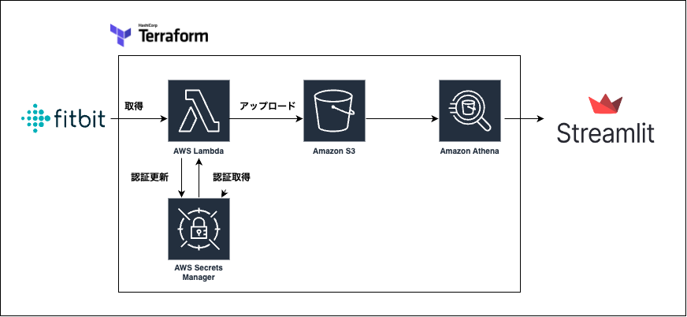

（READMEは一部生成AIによって、作成されています）

# Fitbit Streamlit Webアプリ
Fitbit のデータを可視化するアプリです。フロントエンドは Streamlit を用いて実装され、Athena から boto3 経由で抽出されたデータを元に、各種データの可視化を行います。データ取得処理は Athena クエリで行われ、データは、lambdaによって毎日S3へアップロードされます。

## アーキテクチャ全体の概要



- **フロントエンド (Streamlit)**
  - ユーザーインターフェースを提供し、ユーザーが Fitbit のデータを直感的に確認できるよう設計。
  - Python と Streamlit を使用して、リアルタイムなデータビジュアライゼーションを実現。
  - データ取得は、Athena から boto3 経由で抽出された結果を元に行います。

- **データ取得 (Athena + boto3)**
  - アプリケーションは、Athena に対して SQL クエリを実行し、Fitbit に関する各種指標（sleep, steps, activity, low_intensity）のデータを取得します。
  - boto3 を利用して AWS の認証情報をもとにセッションを確立し、Athena クエリ結果を S3 に出力・取得する仕組みとなっています。

- **バックエンド (AWS Lambda)**
  - `get-fitbit-lambda` ディレクトリには、AWS Lambda を用いたバックエンドのコードが格納されています。
  - fitbitAPIを使用し、毎日データをS3へアップロードします。
  - コード全体はterraformにより管理されます。

## 使用している技術

- **Python**
  - 主にフロントエンド (Streamlit アプリ) とデータ取得処理に使用。シンプルかつパワフルな言語で、コードの可読性と保守性に優れています。

- **Streamlit**
  - Python によるインタラクティブな Web アプリ作成フレームワーク。データの可視化やダッシュボード作成に最適です。

- **AWS Athena & boto3**
  - データ抽出には Athena を用い、boto3 ライブラリで AWS サービスにアクセス。
  - Athena クエリ結果は S3 に出力され、アプリ内で読み込み処理が行われます。
  - これにより、効率的に大規模データの分析が可能となります。

- **AWS Lambda**
  - `get-fitbit-lambda` ディレクトリにおいて、サーバーレスアーキテクチャの一部として利用されるコードを提供。
  - 将来的な拡張や補助的な処理に向けた実装が含まれています。

- **その他**
  - Plotly: データのビジュアライゼーションに使用（グラフ描画）。
  - awswrangler: Athena との連携を容易にするライブラリとして利用。
  - Pandas: データ処理全般に利用。

## ディレクトリ構成

```
fitbit-streamlit/
├── app.py              # Streamlit アプリのエントリーポイント
├── requirements.txt    # 必要な Python ライブラリ一覧
├── .gitignore          # Git で追跡しないファイルの定義
├── LICENSE             # プロジェクトのライセンス（Apache-2.0）
└── get-fitbit-lambda/  # AWS Lambda 用バックエンドのコード（補助的な機能提供）
    ├── Dockerfile
    ├── lambda_function.py
    └── main.tf
```

## セットアップ方法

1. **ローカル環境の準備**
   - Python 3.11 がインストールされていることを確認してください。
   - 仮想環境を作成し、`requirements.txt` を用いて必要なライブラリをインストールします。
     ```bash
     python -m venv venv
     source venv/bin/activate  # Windows の場合は venv\Scripts\activate
     pip install -r requirements.txt
     ```

2. **フロントエンドの起動**
   - `app.py` を実行して Streamlit アプリを起動します。
     ```bash
     streamlit run app.py
     ```

3. **バックエンドの設定 (任意)**
   - AWS CLI や Terraform などを用いて、`get-fitbit-lambda` のコードを AWS Lambda へデプロイする設定を行います。
   - 環境変数や IAM ロールの設定が必要な場合は、別途詳細なドキュメントをご参照ください。

## ユーモアを込めて

データ抽出時に、Athena が「今日はどんなデータが来るかな？」とワクワクしているかもしれません。ログに目を通しながら、データの行間に隠れたユーモアも見逃さないでください！

